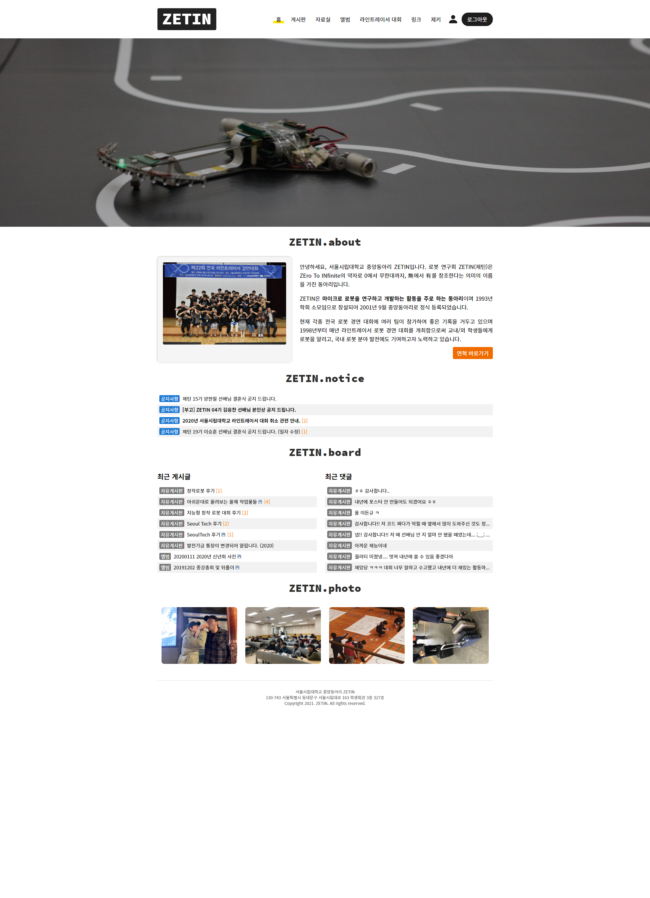
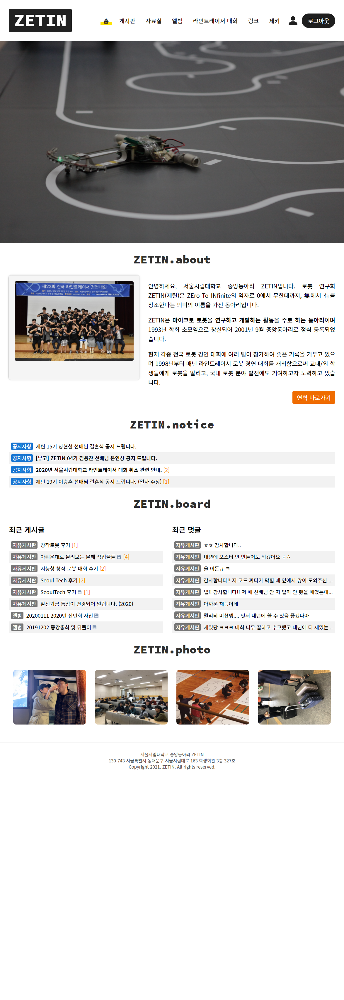
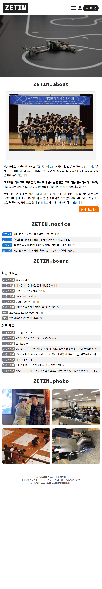

# ZETIN XE Skin

- ZETIN 홈페이지를 위한 스킨
- XE(XpressEngine 1) CMS를 위한 스킨
- HTML, CSS, JS를 적절히 잘 활용함
- 반응형 웹 페이지
- 군대 가기 전에 심심해서 만듦(2020년도 ZETIN 웹 마스터가 되면서 홈페이지를 좀 꾸며봐야겠다는 생각도 들었었음)
- 아직 개발중 ...

## 적용 모습

### PC 화면

### 태블릿 화면

### 모바일 화면

## 적용 방법

`xe` 디렉터리 안에 있는 내용을 모두 XE 웹 서버의 루트 디렉터리에 복사 붙여넣기 한다.